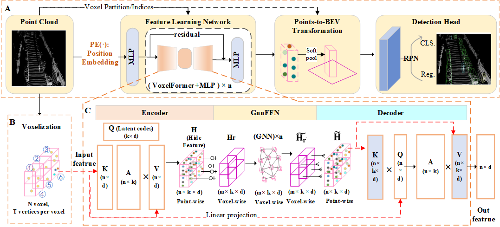

## VoxT-GNN：A 3D Object Detection Approach from Point Cloud based on Voxel-Level Transformer and Graph Neural Network ()

**Authors**: [Qiangwen Wen](https://github.com/yujianxinnian), [Sheng Wu*](http://adcfj.cn/sirc/door/team/TeacherList/Detail?personId=%20422), Jinghui Wei.

This project is built on [OpenPCDet](https://github.com/open-mmlab/OpenPCDet). some codes are from VoxSeT(https://github.com/skyhehe123/VoxSeT).

## Introduction

Due to the irregularity, disorder, sparsity, and highly variable point density of LiDAR point clouds, feature learning for 3D object detection is highly challenging. In this paper, we design a novel voxel-based architecture for 3D object detection in LiDAR point clouds, namely VoxT-GNN, which deeply integrates Transformer and Graph Neural Network architectures to learn more discriminative features of the point cloud through set-to-set transformations while ensuring the speed of inference. In the VoxT-GNN, we propose the VoxelFormer and GnnFNN components. Specifically: First, we group the point cloud through voxelization; Then, we utilize VoxelFormer to learn the local features of each point within the voxel; Next, the GnnFNN is embedded between the encoder and decoder of VoxelFormer to enable cross-voxel information exchange for learning global features; Finally, the classic RPN network is used to accurately estimate the object category, confidence, and location. Extensive experimental results on the KITTI dataset demonstrate that our method can achieve competitive performance, offering certain advantages over the current state-of-the-art benchmark networks, making it a viable alternative for point cloud modeling.

### 1. Recommended Environment
- OpenPCDet Version: 0.5.2
- Linux (tested on Ubuntu 22.04)
- Python 3.7
- PyTorch 1.9 or higher (tested on PyTorch 1.13.0)
- CUDA 9.0 or higher (tested on CUDA 11.7)

voxt_gnn_pv_rcnn_plus.yaml need Version: 0.6.0

### 2. Set the Environment

```shell
pip install -r requirements.txt
python setup.py build_ext --inplace 
```
The [torch_geometric, torch_scatter, torch_sparse, torch_cluster, torch_spline_conv](https://pytorch-geometric.readthedocs.io/en/latest/install/installation.html) package is required


### 3. Data Preparation

- Prepare [KITTI](http://www.cvlibs.net/datasets/kitti/eval_object.php?obj_benchmark=3d) dataset and [road planes](https://drive.google.com/file/d/1d5mq0RXRnvHPVeKx6Q612z0YRO1t2wAp/view?usp=sharing)

```shell
# Download KITTI and organize it into the following form:
├── data
│   ├── kitti
│   │   │── ImageSets
│   │   │── training
│   │   │   ├──calib & velodyne & label_2 & image_2 & (optional: planes)
│   │   │── testing
│   │   │   ├──calib & velodyne & image_2

# Generatedata infos:
python -m pcdet.datasets.kitti.kitti_dataset create_kitti_infos tools/cfgs/dataset_configs/kitti_dataset.yaml
```

### 4. Pretrain model
You can use the pretrain model (/PretrainedModel).

The performance (using 11 recall poisitions) on KITTI validation set is as follows(single-stage):
```
Car  AP@0.70, 0.70, 0.70:
bev  AP:90.16, 88.10, 86.84
3d   AP:88.88, 78.54, 77.60

Pedestrian AP@0.50, 0.50, 0.50:
bev  AP:69.03, 63.65, 58.51
3d   AP:67.23, 60.63, 55.40

Cyclist AP@0.50, 0.50, 0.50:
bev  AP:91.9542, 72.5878, 69.9172
3d   AP:90.8777, 69.9775, 65.7119
```
The runtime is about **18 ms** per sample. (RTX 4090 GPU)

'''
	 Performance comparison with state-of-the-art methods on the KITTI test set. The results are reported by the mAP with 40 recall points.(two-stage)
	 In two-stage models are not suitable to directly report results on KITTI test set, please use slightly lower score threshold and train the models on all or 90% training data to achieve a desirable performance on KITTI test set.
'''
Car  AP@0.70, 0.70, 0.70:
bev  AP: 94.52 88.63 86.04
3D   AP: 90.26 81.53 77.07	
	
Pedestrian AP@0.50, 0.50, 0.50:
bev  AP: 54.30 48.12 45.84
3D   AP: 51.30 44.80 41.70

Cyclist AP@0.50, 0.50, 0.50:
bev  AP: 84.30 71.53 64.90
3D   AP: 82.84 67.88 60.42

### 5. Train

- Train with a single GPU

```shell
python train.py --cfg_file tools/cfgs/kitti_models/voxtnt.yaml
```

- Train with multiple GPUs 

```shell
cd VoxSeT/tools
bash scripts/dist_train.sh --cfg_file ./cfgs/kitti_models/voxtnt.yaml
```
### 6. Test with a pretrained model

```shell
cd VoxSeT/tools
python test.py --cfg_file --cfg_file ./cfgs/kitti_models/voxtnt.yaml --ckpt ${CKPT_FILE}
```

